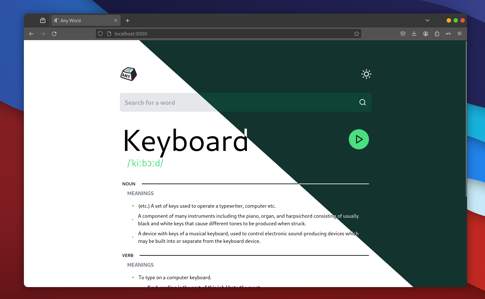

# Any-Word - Your Personal Dictionary

Any-Word is a powerful dictionary application designed to help you quickly and easily find definitions, pronunciations, and usage examples for words. Whether you're a student, writer, or language enthusiast, Any-Word is your go-to tool for exploring the intricacies of language.



## Features

- **Word Definitions:** Instantly search for the meaning of any word.
- **Pronunciation:** Listen to accurate pronunciations of words.
- **Usage Examples:** Explore how words are used in different contexts, including as verbs.
- **Light and Dark Modes:** Customize your reading experience with light and dark themes.

## Technologies Used

- React: A modern frontend framework for building interactive user interfaces.
- Tailwind CSS: Styling the application for a visually appealing and intuitive user experience.
- [DictionaryAPI](https://dictionaryapi.dev/): Provides comprehensive word data and definitions.

## Getting Started

To start using Any-Word:

- 01 Clone the repository:

```bash
	git clone https://github.com/abdelhadia72/any_word.git
```

- 02 Navigate to the project directory:

```bash
	cd any_word
```

- 03 Install dependencies:

```bash
	npm install
```

- 04 Start the application:

```bash
	npm start
```

- 05 Open your browser and go to `http://localhost:3000` to access Any-Word.

## Usage

Simply enter a word in the search bar and press Enter or click the search icon. Any-Word will fetch the definition, pronunciation, and usage examples for your word, providing you with a comprehensive understanding of its meaning and usage.

## Contributing

Contributions are welcome! If you have ideas for improvements or new features, feel free to fork the repository and submit pull requests.
